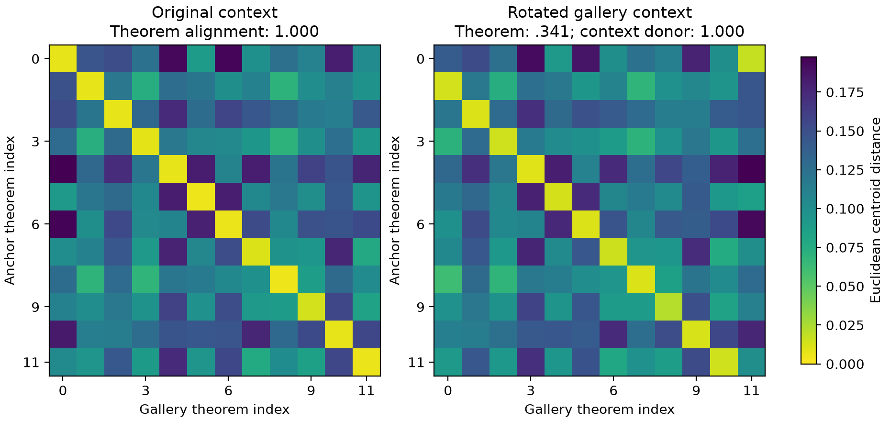

# Why the Horn centroid saturated

**The old added-information failure is a task-design failure, not evidence
against theorem clouds in an informative population.** All measurements remain
preserved. The [intervention protocol](adversarial-centroid-protocol-v1.md) was
committed at `3e68fc4` before running the new diagnostic; implementation launch
was clean commit `9179229`. This examines the already fixed 12-theorem population,
without selecting new pairs or claiming new confirmatory significance.

## Two different artifacts

Every context contains p0, p1 and an acyclic set of implications that proves all
eight atoms. Exhaustive evaluation gives exactly one satisfying valuation for
each context: all atoms true. Twelve constructive Lean certificates establish
that each context is equivalent to p0 ∧ ... ∧ p7, with no axioms or placeholders.
The common conclusion (p4 ∧ p5) ∧ (p6 ∧ p7) holds on 16 of the 256 valuations,
including the context's sole satisfying valuation. Thus the different context
strings do not represent different denotations in this fragment.

Separately, **the text of each context is an identity fingerprint**. There are
12 distinct context strings, and not one of the 60,501 retained states changes
its theorem's initial premise context. Statement and premise self-matching can
identify the theorem without observing a proof. Shared vocabulary alone does
not mathematically force a centroid score of 1.0; invariant, distinguishable
premise text is a sufficient shortcut in the measured encoders.

## Interventions

All entries below are centroid pairwise win rates on the same frozen cross-prover
split; chance is .5. Goal-only entries here are centroid scores, not the energy
cloud scores in the earlier report. Replacement contexts are encoding
counterfactuals, not newly verified proof states.

| Centroid input | Syntax | MiniLM | Exact truth table |
|---|---:|---:|---:|
| Original states | 1.0000 | 1.0000 | .9167 |
| Context alone; no proof variation | 1.0000 | 1.0000 | .5000 |
| Context plus common p0 goal | 1.0000 | 1.0000 | .5000 |
| Gallery context rotated; original alignment | .3939 | .3409 | .9167 |
| Same rotation; context-donor alignment | 1.0000 | 1.0000 | .4091 |
| All contexts replaced by one common context | .9394 | .9318 | .9167 |
| Original goals alone | .9091 | .9091 | .9167 |

Text and syntax follow the **donor context** perfectly even when its associated
proof-goal samples come from another theorem. The truth representation is
unchanged by rotation or common-context substitution because all contexts have
the same truth table. This distinguishes textual identification from a semantic
context distinction.

The remaining goal-only association is real in this operational population:
the corpus has 26 distinct goal formulas, with 15–18 occurring per theorem, and
their frequencies depend on available proof routes. Context carriage explains
a sufficient path to the perfect text score, not every bit of observed signal.
It does not prove that all centroids or all proof populations must saturate.

| Original variance diagnostic | Syntax | MiniLM | Truth table |
|---|---:|---:|---:|
| Within-cloud mean squared radius | .002865 | .004264 | .021391 |
| Between-centroid mean squared radius | .075645 | .007681 | .000390 |

## Consequence

Criterion 4 correctly prevented unsupported intersection discovery, but this
population could not supply evidence of improvement over its saturated cheap
controls. It should not have been treated as a hypothesis-level negative result.
The revised next step is the separately
[preregistered strategy-transfer screen](strategy-transfer-protocol-v1.md):
distinct theorem triplets, a replay-defined relationship, premise overlap matched
by construction, empirical headroom checks, and a Lean-trained encoder.

The [archive](../results/adversarial-v1/report.json.gz) contains all 18 intervention
matrices, both alignments where applicable, variances, Lean responses and source
checksums. Constructive proof sources and all three vector caches accompany it.
No old-corpus pair shortlist was produced.
