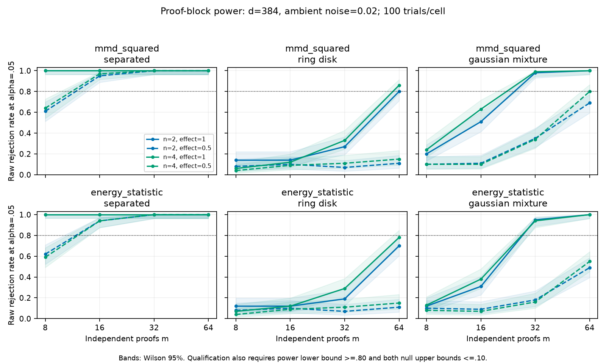

# Proof-cluster power and acquisition budget

The revised plan's Phase 0 is complete for two inferential candidates: frozen
Gaussian MMD squared and energy V-statistic. The selected formal budget is
**32 independent proofs × 4 retained states**, using energy distance in the
specified low-noise 384-dimensional regime. This qualifies large shifts and the
full-strength Gaussian-versus-symmetric-mixture alternative, not arbitrary
geometry, holes, high intrinsic dimensions, or actual Lean-state correlation.

The [protocol](continuation-protocol-v2.md) and grid were committed before the
run. There are 256 strata and 25,600 independently seeded simulated comparisons,
each testing both metrics with 999 **whole-proof** permutations. The 51,200
p-values receive one study-wide BH adjustment. Qualification uses the raw
alpha=.05 power/calibration rates and separately reported Wilson intervals;
adjusted p-values are retained, not substituted for power at the stated alpha.

Each proof has one independently drawn latent center and correlated states
around that center. All points share an orthonormal ambient embedding. The
latent jitter is .10 and ambient noise is per coordinate. Varying m and n
therefore cannot silently turn states from one proof into independent proofs.
Tests verify that duplicating every state within a proof leaves the statistic
and proof-block permutation p-value unchanged.

## Complete envelope and curves

See the [minimum grid envelopes](../results/cluster-power-v1/report.md),
[complete 512-row power table](../results/cluster-power-v1/power-curves.csv), and
[raw trials](../results/cluster-power-v1/report.json.gz). The table includes every
metric, m, n, d, noise, family and effect cell, including all failures.

The archive also contains figures for dimension 256 and ambient noise .15.
Dashed curves use a 50% alternative-center mixture; solid curves use the full
alternative. The bands are Wilson 95% intervals. Passing .80 as a point estimate
is insufficient: the lower power bound must reach .80, and both null upper
bounds must be at most .10. This deliberately conservative precision guard can
fail when the observed null rejection rate is close to nominal .05; a failure
does not by itself prove an invalid permutation test.

## Independent confirmation and frozen choice

The union of every provisional minimum and its two nulls was frozen at
`76ccd90` before independently seeded confirmation. There are 17 strata:
1,800 alternative trials and 3,200 null trials, with 10,000 tested p-values.
No failed cell received selectively added trials. See the
[replication envelopes](../results/cluster-replication-v1/report.md) and
[selection manifest](../configs/cluster-replication-v1/freeze.json).

For energy distance at m=32, n=4, d=384, noise=.02:

| Setting | Calibration | Independent replication | Replication Wilson 95% |
|---|---:|---:|---:|
| Gaussian null | 4/100 | 25/400 = .0625 | [.0427, .0906] |
| Ring null | 2/100 | 18/400 = .0450 | [.0287, .0700] |
| Separated Gaussian, full effect | 100/100 | 200/200 = 1.000 | [.9812, 1.000] |
| Gaussian/mixture, full effect | 94/100 | 179/200 = .895 | [.8448, .9303] |

MMD has stronger observed multimodal power, but its calibration Gaussian-null
cell at this regime was 6/100, with upper Wilson bound .1248. It therefore
failed the frozen first-stage guard. Its subsequent improvement in the jointly
run replication does not retroactively pass that guard. The preregistered
fallback selects energy, which passes both stages at the same structural
sampling regime. Lower-budget location-only qualifications are not enough for
this continuation's structural target.

Ring/disk and weaker structural effects remain unqualified under the full
criteria throughout this grid. Sliced transport and neighborhood coverage are
descriptive candidates only; persistent homology receives no power claim and
is excluded from this primary experiment. The earlier iid shape/branch study
remains historical evidence, not proof-cluster qualification for these metrics.

## Nongeometric acquisition check

The original verified corpus has median native tactic lengths 31 backward and
13 forward. The expanded native-replay pilot used 8,192 backward attempts and
forward width 512 on each of 24 theorems. Exhaustive examination of all
2,704,156 twelve-theorem subsets found **zero** common exact-length capacity.
Even mixing lengths cannot provide the globally matched comparison required
by the fixed protocol. This is a failure of that bounded replay design, not
evidence against H1 from a matched geometric experiment.

Code inspection showed the different replay granularities. The separately
preregistered [canonical-replay redesign](canonical-replay-protocol-v3.md) uses
fresh theorem seed 132671 and preserves the two discovery algorithms. Its
nongeometric pilot supports 134 proofs per generator on a common 12-theorem
subset, or 63 per side when both within-prover splits must be disjoint.
The qualified m=32 budget is therefore attainable without padding or state
duplication. The exact frozen acquisition selects 1,864 scripts, including
unmatched controls; acceptance still requires Lean and actual state deduplication.

The [native pilot](../results/corpus-pilot-v2/report.json) and
[canonical pilot](../results/corpus-pilot-canonical-v3/report.json) retain all
theorem yields, length histograms, shared identities, predicted duplicates,
provenance and exhaustive support results. External metadata records L, i and
u=i/(L-1) for every retained state in the original corpus. Candidate counts are
not accepted-proof counts, and distinct proof trees alone do not establish
statistical independence of every output of a bounded search run.
