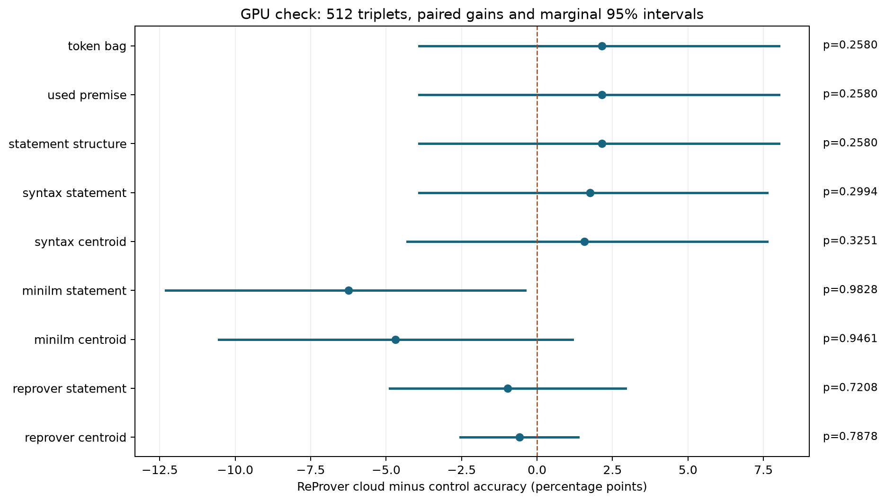

# Strategy-transfer result: no demonstrated State object advantage

Scope clarification, September 14, 2026: the experiment below compared finite
samples of eight state vectors using energy distance. It did not construct an
occupied region or test intersections or topology. The intended State object is
such a region across alternative proofs. Accordingly, the numerical result is
about the sampled-state transfer predictor, not a test of that region-based
objective. The historical terminology and numerical account below are retained;
the [convex-hull literature review](state-object-convex-hull-literature-review.md)
sets out the corrected question. No convex-hull experiment has been run.

The completed 512-triplet study does not show added information from the
ReProver State object over the registered cheap controls. State object accuracy is
276/512 (53.91%), versus 279/512 (54.49%) for its centroid. The paired difference
is -0.59 percentage points, with a marginal bootstrap 95% interval of
[-2.54, +1.37] points. No ten-point improvement requirement is applied.

Here the **State object** is the proposed theorem-level representation \(X_T\):
an unordered collection of embedded proof states. This implementation samples
two states from each of four proofs. Each ReProver state vector has 1,472
numerical coordinates, giving a State object of eight such vectors per theorem.

Accuracy refers to a specific prediction. Each trial supplies an anchor theorem
A and two candidate theorems, B and C. Comparing their State objects with energy
distance selects the candidate expected to have the better verified mutual
proof-strategy transfer relationship with A. The State object comparison selects
the correct candidate in 276 of the 512 trials. The centroid comparison averages
the same eight elements before selecting a candidate and succeeds in 279 trials.

All nine cheap controls have meaningful headroom: the largest one-sided exact
95% upper accuracy bound is 63.76%, well below the .90 diagnostic ceiling.
This result therefore avoids the earlier saturated-baseline failure. It is
limited evidence about this synthetic transfer task, encoder and eight-point
sampling budget, not a rejection of the broader State object conjecture.

## Population and controls

The 512 frozen nine-leaf associativity triplets contain 1,536 theorem endpoint
pairs. All 6,144 sampled proofs and 30,720 intermediate states passed Lean
verification. The shortest-proof banks, literal transfer labels and complete
deterministic assignment search were independently reproduced. Positive candidates
permit at least .75 mutual shortest-program transfer;
negative candidates permit none. Source-clade overlap, target-clade overlap and
used-premise overlap match exactly within every triplet. Endpoint pairs and proof
programs are disjoint across confirmation triplets. There are 272 program
patterns shared with the eight-leaf development set, so this is a held-out
population within one synthetic family, not independence from all earlier motifs.

Each theorem State object contains two sampled intermediate states from each of four
verified proofs, with proof identity and order discarded for energy distance.
All 8,500 distinct ReProver input texts were encoded uniformly on CUDA; no CPU
ReProver vectors were mixed in. The syntax and MiniLM arms use their completed
CPU caches. The original weights, byte tokenizer, singleton batches, precision
setting and host NumPy pooling were retained. GPU output required an explicit
storage transfer to the host before that unchanged pooling.

The following applies the frozen one-sided paired tests and 10,000 shared
triplet-bootstrap resamples descriptively to the GPU run. The single original
claim requires superiority over all nine controls; none of these components
passes at .05. Intervals are marginal, not simultaneous.

| Control | Accuracy | State object minus control (points) | Marginal 95% interval | One-sided p |
|---|---:|---:|---:|---:|
| token bag | 51.76% | +2.15 | [-3.91, +8.01] | 0.2580 |
| used premise | 51.76% | +2.15 | [-3.91, +8.01] | 0.2580 |
| statement structure | 51.76% | +2.15 | [-3.91, +8.01] | 0.2580 |
| syntax statement | 52.15% | +1.76 | [-3.91, +7.62] | 0.2994 |
| syntax centroid | 52.34% | +1.56 | [-4.30, +7.62] | 0.3251 |
| minilm statement | 60.16% | -6.25 | [-12.30, -0.39] | 0.9828 |
| minilm centroid | 58.59% | -4.69 | [-10.55, +1.17] | 0.9461 |
| reprover statement | 54.88% | -0.98 | [-4.88, +2.93] | 0.7208 |
| reprover centroid | 54.49% | -0.59 | [-2.54, +1.37] | 0.7878 |

The centroid comparison has 11 successes unique to the State object comparison and 14 centroid-only
successes; the two representations agree on 487/512 triplets. This explains the
small observed gain and narrow paired interval relative to less correlated
controls. A nonsignificant result does not establish exact equality, and the
interval still allows a gain near one point. The fixed sample size was not
expanded after results, and the removed ten-point gate was not restored.

Syntax State object accuracy is 49.41%; MiniLM State object accuracy is 57.03%. Their own
centroids score 52.34% and 58.59%, respectively. None of the three State object scores
exceeds its corresponding centroid score in this completed run.

## Original-plan proof controls

The [baseline supplement](confirmation-baseline-supplement-v1.md) was committed
before confirmation embeddings. Its complete results are archived, including
strata, ties, gains and intervals. Selected comparisons are:

| Representation | Accuracy |
|---|---:|
| ReProver State object | 53.91% |
| ReProver first sampled proof mean | 55.86% |
| ReProver means retaining sampled state positions | 55.66% |
| Tactic-component histogram | 82.03% |
| Sampled complete-program overlap | 92.19% |

The complete-program comparison sees all five proof steps and their order,
whereas the State object sees only two states per proof. The tactic histogram also summarizes complete proof scripts. Both controls
therefore have more proof evidence than the sampled State object, and their
advantages are not information-matched comparisons. They nevertheless demonstrate
that proof evidence can predict this task substantially better than these
encoded State objects. They do not identify which representation or sampling
change would recover that information. No comparator was selected after results
as a new primary gate.

## Compute, reproducibility and limits

The A10G encoded all 8,500 texts in 54.19 seconds including checkpoint writes.
The separate 128-text benchmark measured 168.34 texts/sec after warm-up; the
short local CPU timing comparison measured approximately .667/sec. These are
execution measurements, not additional independent experimental replications.

Despite the same int8_float32 setting, the benchmark's GPU and CPU vectors have
mean L2 difference .06160 and minimum cosine .99598. The differences exceed
rounding noise, which is why caches were kept separate. The first benchmark
attempt failed on the CUDA storage interface before producing measured vectors;
the failure, adapter correction and successful sample are retained.

The instance was terminated and its temporary security group and registered SSH
key removed. Its lifetime gives an upper compute-cost estimate of USD .266,
excluding small storage/network charges; this is not a final billing invoice.
The approved budget was USD 5. No AWS resource remains for this task.

The [GPU archive](../results/gpu-execution-check-v1/README.md) and
[benchmark archive](../results/device-benchmark-v1/README.md) contain vectors,
source/data hashes, runtime manifests and numerical reproduction results.
`scripts/verify-gpu-execution.py` reproduces every saved GPU score, paired test,
bootstrap interval and supplemental control without model weights or GPU access;
all fields reproduce exactly locally. The three new benchmark/transport tests
pass, alongside the earlier 99-test suite and two scheduler tests.

The task has headroom and premise overlap is controlled by design. The observed
negative added-information result is bounded by one synthetic family, one
Lean-trained encoder implementation, four proofs and two states per proof,
and the assumption that triplets are suitable independent sampling units.
Program disjointness alone cannot establish independence of every structural
motif. The findings do not establish cross-domain mathematical relatedness,
latent manifolds, or novel mathematical discoveries. They supply no positive
evidence here for proceeding to Phase 5; no old-corpus pair mining or full
mathlib acquisition was performed.

## Execution provenance

The original protocol (`d2bb6d6`), analysis (`30337a3`) and assignments
(`ec6dfb1`) were frozen before acquisition. The user approved GPU acceleration;
the [execution supplement](gpu-execution-check-v1.md), committed at `2c2e357`
before confirmation GPU embeddings or scores, retained the same theorem set,
model weights, sampled proofs, metrics and controls. The analysis wrapper was
committed at `322fa31` and formatted at `c67920e` before scoring.

That supplement initially designated the GPU run as a secondary hardware check.
After its complete result was available, the user cancelled the remaining CPU
encoding at 7,270/8,500 cached inputs. No partial CPU outcome was scored. These
records are preserved as execution history; finishing a CPU duplicate is not a
condition for using the complete experimental results reported here. CPU versus
GPU is a reproducibility detail, not a separate hypothesis about State objects.
