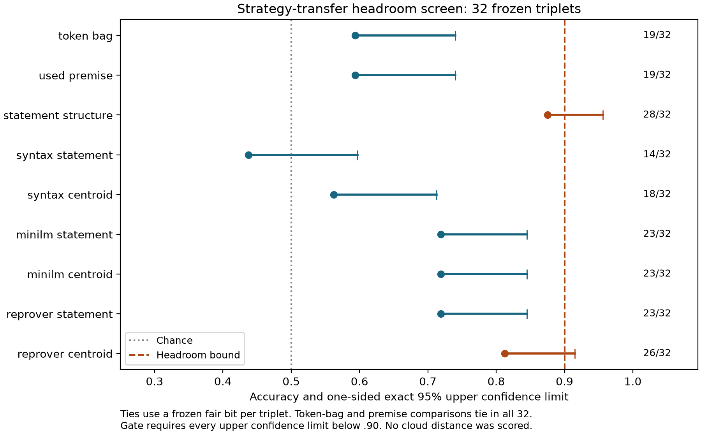

# Added-information continuation: a completed headroom screen

**The bounded experiment does not qualify for confirmation. This is a
task-design and power result, not a negative result about theorem clouds.**
The old Horn centroid shortcut is now experimentally documented. The new
population controls premise overlap by design and includes a Lean-trained
encoder, but the structural statement and Lean-trained centroid controls fail
the required headroom bounds. No cloud-distance outcome or Phase 5 discovery
is reported.

## Why the old conclusion changed

The [adversarial diagnosis](adversarial-centroid-results-v1.md) found that all
12 Horn contexts are logically equivalent to all eight atoms being true,
verified constructively in Lean. Their 12 different text strings remain fixed
through all 60,501 recorded states. Context text alone scores 1.000; after
swapping gallery contexts, syntax and MiniLM centroids follow the context donor
with score 1.000. The theorem's original alignment falls to .394 and .341.
This is a sufficient textual identity shortcut. Residual goal-only association
also exists, so context carriage does not explain every part of the signal.

The canonical experiment's measurements remain intact. Its ceiling could not
establish or reject an advantage over simpler representations. The historical
[result](revised-plan-results.md) now states that limitation explicitly.

## What the new experiment actually tested

The [preregistration](strategy-transfer-protocol-v1.md), committed before any
candidate embeddings, defines successful associativity-strategy transfer as
replaying the same subtree rotations on another theorem, allowing uniform
operation and variable substitution. Both endpoints differ between anchor and
candidates. Every theorem has shortest proof length five and at least eight
distinct shortest strategies. Positives transfer at least 75% in both directions;
negatives transfer zero. This operational relation is independently checked by
symbolic replay and is narrower than general mathematical relatedness.

There are 32 frozen seven-leaf triplets and 96 distinct endpoint pairs. Every
theorem has the same available premises, f/g and both associativity laws.
Sixteen triplets have used-premise overlap 1; sixteen have overlap 0. Within each
triplet the positive and negative have exactly equal overlap with the anchor.
Token-bag distances also match. Independent variable permutations prevent a
shared variable naming convention from defining the relationship label.

Each theorem contributes four distinct shortest programs and positions 1 and 3
after rotation: eight intermediate state occurrences. Initial and terminal
goals are excluded. Across statements and sampled states there are 607 unique
texts. A fixed 24-proof Lean fixture verifies 120 pre-rotation states against
the renderer, without axioms or placeholders. The remaining development
programs are symbolic samples, not an acquired and fully Lean-verified corpus.
Every encoded text has exactly 249 ByT5 tokens, including EOS.

The learned arms are the old general-text MiniLM and the Lean-trained
[ReProver premise retriever](https://github.com/lean-dojo/ReProver#retrieval),
with an author-published export, pinned hashes, CPU int8_float32 computation,
byte tokenization, masked mean pooling and 1,472-dimensional normalized vectors.
No task training, theorem labels, strategy labels or proof-order metadata enter
the encoder. Syntax n-grams provide a third arm. Runtime and quantization limits
are documented in the [reproduction guide](reproduction-strategy-transfer-v1.md).

## Headroom results

The gate requires the one-sided exact 95% upper accuracy bound to be below .90
for **every** cheap control. It is evaluated before any energy/cloud distances.
Ties use one fixed fair bit per triplet, shared across methods; a separate
tie-adjusted score gives half credit. Premise and token-bag controls tie on all
32 triplets, so their randomized score is not evidence of predictive signal.

| Control | Correct / 32 | Accuracy | Tie-adjusted | Upper 95% | Overlap 0 | Overlap 1 |
|---|---:|---:|---:|---:|---:|---:|
| token bag | 19 | 0.5938 | 0.5000 | 0.7403 | 0.5000 | 0.6875 |
| used premise | 19 | 0.5938 | 0.5000 | 0.7403 | 0.5000 | 0.6875 |
| statement structure | 28 | 0.8750 | 0.8750 | 0.9562 | 0.8750 | 0.8750 |
| syntax statement | 14 | 0.4375 | 0.4375 | 0.5968 | 0.5000 | 0.3750 |
| syntax centroid | 18 | 0.5625 | 0.5625 | 0.7127 | 0.6250 | 0.5000 |
| minilm statement | 23 | 0.7188 | 0.7188 | 0.8447 | 0.6250 | 0.8125 |
| minilm centroid | 23 | 0.7188 | 0.7188 | 0.8447 | 0.6250 | 0.8125 |
| reprover statement | 23 | 0.7188 | 0.7188 | 0.8447 | 0.6250 | 0.8125 |
| reprover centroid | 26 | 0.8125 | 0.8125 | 0.9150 | 0.7500 | 0.8750 |

The structural statement control uses only source/target tree clades, with leaf
names and operation names normalized. It has no proof or transfer-label input.
Its positive-candidate mean distance is .6602 versus .8232 for negatives.
Controlling premise overlap therefore removes the old confound, but does not
fully decorrelate statement structure and strategy transfer. The result fails
to establish headroom; it does not prove that this population's true baseline
accuracy is 1.0 or that clouds could never improve on it.

ReProver's centroid scores 26/32 (.8125), compared with 23/32 (.7188) for its
statement embedding. Its upper bound is .9150, also above the .90 cutoff.
Neither failure means that the observed centroid is at ceiling. The small
screen has not demonstrated the registered amount of reliable headroom.

The confidence calculation treats triplets as independent. A disclosed
post-screen structural audit finds 29 positive-transfer components among 32
anchors; three components contain two anchors each. Distinct endpoint pairs
do not guarantee independent structural families. Even under the screen's
optimistic independence assumption, qualification fails. No more precise
population-level inference is justified by this small convenience family.

## Power and the bounded budget

Before headroom scoring, 60,000 simulated experiments evaluated the exact
planned paired decision rule at three sample sizes under null and alternative.
Each experiment compares the primary cloud outcome against all nine controls:
at least .10 observed gain and one-sided exact McNemar p≤.05 against every one.
The assumed meaningful alternative is cloud accuracy .80 versus .65 controls,
with paired discordance .35; controls are conditionally independent given the
cloud outcome. This is deliberately a strong-control planning scenario, not a
fitted description of the observed screen or of its necessarily tied controls.

| Independent triplets | Joint detection rate | Wilson 95% interval |
|---|---:|---:|
| 64 | .1198 | [.1136, .1263] |
| 128 | .4172 | [.4076, .4269] |
| 256 | .6101 | [.6005, .6196] |

No tested budget meets the prespecified lower-bound requirement above .80.
The all-controls-null simulation has 0/10,000 joint rejections at each size;
this is not a claim of zero error under every composite null. The paired exact
test controls the intersection-union claim through each component null under
its exchangeability assumptions. The archived arrays retain all 540,000 paired
gain/p-value calculations, not only aggregate rates.

The separate [exact headroom operating-characteristic calculation](../results/strategy-transfer-v1/headroom-power.json)
shows that the 32-triplet screen passes an individual control only at ≤25 correct.
Its pass probability is .9638 when true accuracy is .65 and .0358 when it is .90.
Requiring all controls to pass reduces sensitivity further; their correlations
matter. These calculations expose the screen's limited resolution, not evidence
of a cloud effect. No budget was enlarged or criterion relaxed after inspection.

## Completed disposition and limits

The requested first diagnostic and small preregistered screen are complete.
The headroom gate (two controls) and the confirmation-power gate both fail. The
conditional proof-sampling stability check and held-out eight-leaf confirmation
therefore do not open. Energy distances were never scored; no full mathlib
acquisition, new Horn-pair mining, or Phase 5 analysis occurred.

The new population improves the design by eliminating statement self-matches
and exact premise shortcuts, but it does not yet supply a qualified
added-information test. Any further design must account for structural
statement similarity and attainable joint power before acquisition. The
theorem-cloud added-information hypothesis remains unresolved.

All assignments, program banks, 24 Lean responses/sources, baseline distances,
per-triplet outcomes, encoder metadata, vectors, power trials and checksums are
in the [result archive](../results/strategy-transfer-v1/headroom-report.json).
The [reproduction guide](reproduction-strategy-transfer-v1.md) covers source,
model acquisition and fast archive-only verification. Cached reproduction
checks every field of all nine baselines and all 18 Horn interventions; it is
not an independent statistical replication.
