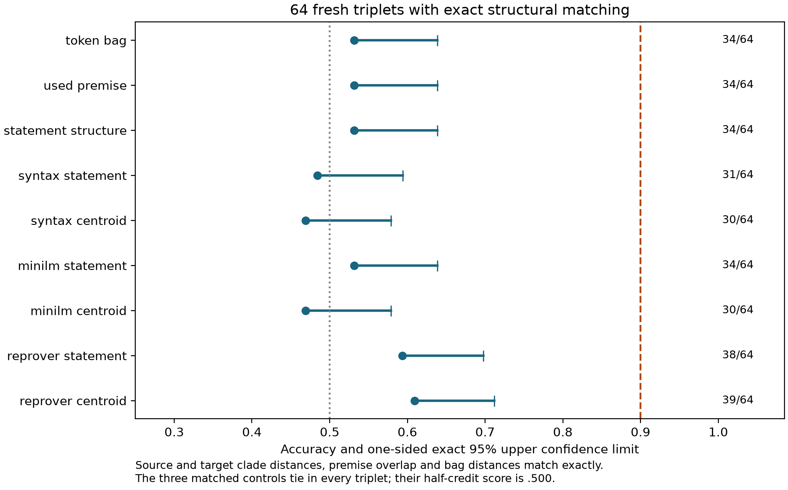

# Structurally matched strategy transfer: execution record

The user authorized continuing after v1's task and budget failures. This fresh
experiment directly addresses both: source and target statement similarity are
matched separately, and the planned confirmation budget is determined by a
larger power grid. The v1 candidate remains closed and its clouds remain unscored.

The [protocol](strategy-transfer-protocol-v2.md) is a local Git preregistration,
committed before embeddings. The [assignment freeze](../results/strategy-transfer-v2/assignment-freeze.json)
retains the exact population, sampling choices and source hashes. This experiment
uses eight leaves for development and reserves nine leaves for conditional
confirmation; no seven-leaf or Horn pair is reused.

## What changed

Positive strategy-transfer pairs and zero-transfer negatives now have exactly
equal source-clade intersections and exactly equal target-clade intersections
with the anchor. Consequently each component of structural Jaccard distance
ties, as do premise overlap and token-bag distance. The matching is symbolic;
learned geometry does not select candidates. The frozen 64-triplet
population has 32 triplets in each used-premise-overlap stratum, 0 and 1.

The frozen population has 192 distinct theorem endpoint pairs and 1,640 distinct
shortest programs. No program is reused across triplets. Positive sharing within
a triplet is intentional and defines transfer; the negative shares no program
with either positive member. This prevents direct program reuse across sampling
units, while leaving the broader limits of a small synthetic family explicit.

The matching has a simple exact justification. An ordered full binary tree with
n distinct leaves has n−2 proper nontrivial clades. If two such clade sets share
k elements, their Jaccard distance is `1 − k / (2(n−2) − k)`. Matching k separately
at the source and target therefore fixes both distances exactly; it does not
depend on a fitted statistical adjustment.

The transfer oracle is also exact within its stated language. Both endpoint
pairs have shortest distance five, and each complete program bank contains all
five-step shortest programs. A program from A succeeds on B if and only if it
belongs to B's bank. Thus the directed transfer rate is `|P_A ∩ P_B| / |P_A|`.
The archive verifier additionally performs literal replay in both directions,
rather than trusting set-intersection labels alone.

Each cloud still samples four distinct proofs and intermediate positions 1 and
3 of five rotations. The new screen has 1,099 unique statement/state inputs,
all exactly 266 ByT5 tokens. The fixed 24-proof Lean fixture passes, with 120
intermediate states matching the symbolic renderer. No encoder, distance,
sampling budget, effect threshold or headroom cutoff was changed after scores.

## Power qualification

The planning alternative remains cloud accuracy .80 versus .65 for each of nine
controls, with paired discordance .35. The joint rule still requires a gain of
at least .10 and exact one-sided McNemar p≤.05 against every control. Simulated
controls are conditionally independent given the cloud outcome. These are
planning assumptions, not a fitted estimate of the actual cloud effect; they
are conservative for the three controls that tie by design.

| Independent triplets | Detection rate | Wilson 95% interval | All-null rejection | One-equal-control null rejection |
|---|---:|---:|---:|---:|
| 256 | .6134 | [.6038, .6229] | .0000 | .0027 |
| 512 | .8397 | [.8324, .8468] | .0000 | .0000 |
| 1,024 | .9803 | [.9774, .9828] | .0000 | .0000 |

**512 triplets qualifies**, because its lower power bound exceeds .80 and both
null upper bounds are below .10. The composite-null check retains one equally
accurate .65 control and makes the other eight independent fair predictors.
Each row/condition has 10,000 trials: 90,000 simulated experiments and 810,000
paired comparisons overall. All individual gains/p-values are archived.

The 64-triplet headroom screen permits at most 52 correct for an upper bound
below .90. An individual control passes with probability .9986 at true accuracy
.65, .9065 at .75, .6477 at .80, and .0236 at .90. Passing all controls depends
on their joint behavior; neither these calculations nor qualification establishes
a real cloud effect.

## Measured headroom and conditional outcome

**Headroom passes for all nine controls.** The conditional geometry test is
now open; its results will be added after the registered run.

| Control | Correct / 64 | Accuracy | Upper 95% | Overlap 0 | Overlap 1 |
|---|---:|---:|---:|---:|---:|
| token bag | 34 | 0.5312 | 0.6388 | 0.6250 | 0.4375 |
| used premise | 34 | 0.5312 | 0.6388 | 0.6250 | 0.4375 |
| statement structure | 34 | 0.5312 | 0.6388 | 0.6250 | 0.4375 |
| syntax statement | 31 | 0.4844 | 0.5938 | 0.6250 | 0.3438 |
| syntax centroid | 30 | 0.4688 | 0.5786 | 0.5000 | 0.4375 |
| minilm statement | 34 | 0.5312 | 0.6388 | 0.4375 | 0.6250 |
| minilm centroid | 30 | 0.4688 | 0.5786 | 0.4062 | 0.5312 |
| reprover statement | 38 | 0.5938 | 0.6975 | 0.5938 | 0.5938 |
| reprover centroid | 39 | 0.6094 | 0.7119 | 0.6562 | 0.5625 |

The three symbolic controls tie in every triplet; their half-credit accuracy
is .5000. Their .5313 binary score comes solely from the frozen fair tie bits.
The strongest measured control is the ReProver centroid at 39/64=.6094, with
upper bound .7119. All baseline bounds are below the unchanged .90 threshold.

<!-- Conditional geometry outcome will be inserted after the frozen run. -->

## Reproduction and scope

All analyses consume state content without theorem IDs, proof-program addresses,
transfer labels or sequence metadata. The classifiers are the prespecified
nearest-candidate rules, with no task training. ReProver is the same pinned
Lean-trained retriever used in v1; syntax and MiniLM are representation controls.
The [reproduction guide](reproduction-strategy-transfer-v2.md) documents dependencies,
source/encoder hashes, restart-safe vector checkpoints and archive-only checks.

The independent symbolic replay audit and Lean fixture check operational
correctness. They do not turn the small synthetic family into a representative
sample of mathematics. Triplets have no direct program reuse, but hidden shared
structural features can still induce dependence. Any resampling stability
result is conditional on this fixed development population, not a replication.
Phase 5 and full mathlib acquisition are outside this continuation.

An ancillary portability check found that a different BLAS CPU kernel shifts
old archived distances by at most 1.11e-16 without changing any predictions or
decisions. Archive verification now reports float drift with tight 1e-12
absolute/relative bounds; discrete outcomes remain exact. This changes neither
the experiment's tie threshold nor its decision rules.
