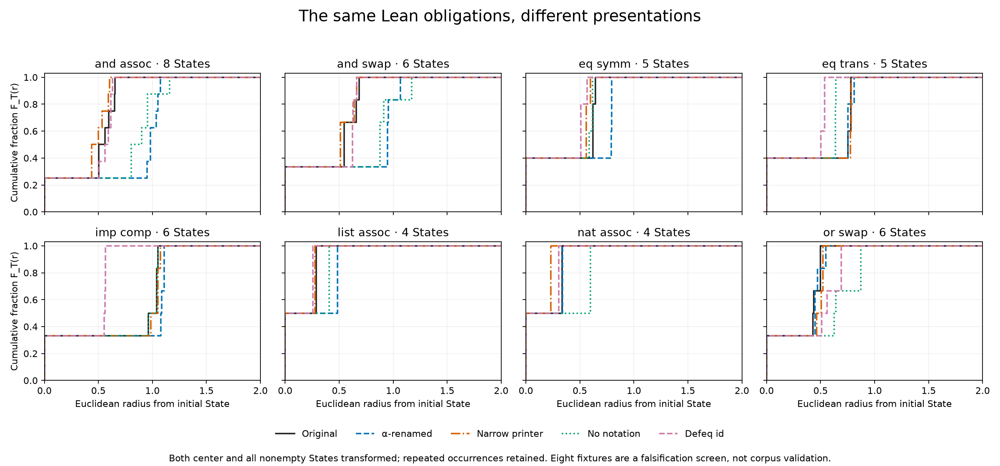

# Encoder invariance: failed falsification screen

The current ReProver measurement is sensitive to presentation even after removing
`no goals` and transforming both the initial-State center and every proof State.
**Do not interpret its distances, F_T curves or rankings as mathematical
relatedness.** Further corpus acquisition and connection case studies do not
resolve this failure. The broader possibility of useful theorem geometry remains
open; this experiment tests one fixed measurement.

## Measured result

Eight Lean-core theorem fixtures, two explicit proofs each, 44 nonempty State
occurrences. Every occurrence has a separate vector in each of five arms: 220
vectors, plus 44 fresh original encodings to check repeatability. Sixteen terminal
checkpoints are archived and excluded from geometry. No acquired fixture State
was sampled or deduplicated. This small, deliberately constructed suite is a
falsification test, not validation of the 102-theorem admitted corpus or a survey
of mathematics. The two proofs per fixture are the declared test inventory, not
a claim to contain every known mathematical proof.

| Transformation | Fixtures with changed F_T | Median sup CDF change | Median radial W₁ | Largest paired radius shift | Changed nearest-center sets |
|---|---:|---:|---:|---:|---:|
| α-renaming | 8/8 | 0.55 | 0.0734 | 0.4769 | 0/8 |
| Printer width 1000 → 20 | 8/8 | 0.50 | 0.0214 | 0.1071 | 0/8 |
| Disable notation, enable full names | 7/8 | 0.60 | 0.1043 | 0.5072 | 3/8 |
| Definitionally equal `id` goal wrapper | 8/8 | 0.55 | 0.0481 | 0.4885 | 1/8 |

Both center and States change together in this table. All eight objects use
their initial State as center, not a centroid. The observed initial checkpoints
also remain in the empirical mass; the reference center is not added as a new
observation. Every original repeat encoding was identical: maximum drift **0**.
The numerical identity tolerance fixed by the protocol is therefore **1e-6**.
All counted F_T changes also have W₁ greater than this tolerance; they are not
merely near-zero shifts producing a discontinuous CDF jump. This tolerance tests
numerical invariance, not practical semantic adequacy.

W₁ is the area between the two empirical cumulative curves, in the original
Euclidean radius units. Distances between unit vectors lie in [0, 2]. A large
sup CDF difference can reflect a small horizontal shift when mass is concentrated;
the radial W₁ and maximum drift columns make that distinction visible. No
independence, population frequency, causal percentage or significance claim is
made from these eight selected fixtures.



The notation-disabled arm leaves the implication-composition fixture's inputs
unchanged; its one nonfailure is an identity control, not evidence of semantic
robustness. Narrow printing changes only 20 of 44 State texts, but changes every
initial center. Re-centering alone can therefore alter every curve. Separate
center-only and State-only diagnostics are retained in `analysis.json`.

Nearest-center choices alone conceal instability: α-renaming leaves their tie
sets unchanged here while reversing 24 strict candidate orderings across the
eight anchors. Narrow printing reverses seven, notation changes 31, and `id`
restatement reverses ten. Comparisons exclude ties within the numerical tolerance;
nearest neighbors are reported as complete tie sets. The other fixtures are
comparison objects, not mathematically certified unrelated controls.

## Concrete equivalent-State witnesses

Renaming this implication-composition State moves its unit embedding **1.2287**:

```text
A B C : Prop             x1 x2 x3 : Prop
f : A → B                x4 : x1 → x2
g : B → C                x5 : x2 → x3
h : A                    x6 : x1
⊢ C                      ⊢ x3
```

At another checkpoint of that proof, changing only the goal `⊢ A` to `⊢ id A`
moves the embedding **1.2854**, with the local context unchanged. Lean checks the
closed obligation definitionally equal. Merely narrowing the initial goal's
printer width moves its embedding **0.3779**. These are observed point distances;
the table above separately measures the effect on the center-relative object.

The earlier forms report's 78.4% was the median empty/nonempty between-group
spread decomposition; formatting had a separate diagnostic. This new failure
uses no terminal empty point, so removing that point does not repair the encoder.

## Formal checks and limits

`Fixtures.lean` instruments every explicit proof step, including introductions,
and records all pending goals at each checkpoint. Fixtures cover conjunction,
implication, disjunction, equality, natural-number addition and list append. The
short tactic proofs are fully checked; automation internals are not extracted.

α-renaming changes local declaration names and bound-variable annotations on
Lean expressions, preserving variable identities and constants. Pretty-print
controls render the same expressions with different settings. The `id` control
constructs a transparent wrapper around each goal's proposition. Every arm
recloses the local context and checks definitional equality to the original
closed obligation; unresolved expression metavariables fail the run. A negative
`True`/`False` comparison is rejected. All 16 theorem axiom closures are within
the foundational allowlist; the only axiom used by these fixtures is `propext`.

The saved expression evidence certifies the structured transformations. This
does not claim arbitrary `ppGoal` strings uniquely identify Lean States or that
all printed inputs round-trip independently. The benchmark contains no local
let declarations, typeclass-heavy mathematics or universes beyond these core
fixtures. It demonstrates failure in a small supported setting; it does not
establish robustness elsewhere or estimate prevalence in the admitted corpus.

The encoder uses the existing pinned weights, CPU `int8_float32`, singleton
batches, all UTF-8 bytes plus EOS, float64 mean pooling and L2 normalization.
All inputs fit the existing 1024-token limit without truncation. No archived
vector, device mixture, learned correction or selected canonicalization is used.
The syntax-only control is reported separately in `syntax-control.json`; it is
not a semantic gold standard. Its narrow-printer arm has exactly zero radius
drift in all eight fixtures, as expected for a whitespace-insensitive token
baseline. The analysis can therefore distinguish an invariant control from the
ReProver failure. Old corpus and case-study archives are unchanged.

## Consequence and next work

The current representation fails a necessary measurement check. Passing an
invariance screen would still be insufficient to establish relatedness: a
constant encoder would pass while measuring nothing. A future repair needs an
explicit structured serialization policy, tested independently for these
invariances **and** for preserving meaningful distinctions. Specify that repair
before looking for attractive case studies, then rerun this retained suite and
new controls. Do not choose normalizations or tolerances to rescue these results,
or claim complete defeq canonicalization from a finite wrapper test.

## Reproduce and inspect

With the repository's pinned base, encoder and Lean tools installed:

```bash
# Recompute all statistics from the archive; no model or Lean run required.
OPENBLAS_NUM_THREADS=1 OMP_NUM_THREADS=1 .venv/bin/python \
  scripts/audit-encoder-invariance.py verify

# Fresh Lean verification and encoding into a separate directory.
OPENBLAS_NUM_THREADS=1 OMP_NUM_THREADS=1 .venv/bin/python \
  scripts/audit-encoder-invariance.py run --output outputs/invariance-reproduction

# Optional plot regeneration using the plots dependency.
OPENBLAS_NUM_THREADS=1 OMP_NUM_THREADS=1 .venv/bin/python \
  scripts/render-encoder-invariance.py
```

`protocol.md` predates the measurements. `Fixtures.lean` and `lean-output.log`
retain the proofs, negative check, terminal checkpoints and per-goal expression
certificates. `inputs.json` maps every nonempty occurrence/arm to its physical
row in `vectors.npy`; `repeats.npy` follows the original-arm row order.
`encoder.json` records model, runtime, source and protocol hashes.
`analysis.json` retains all radii, distance matrices, rank changes and witnesses;
`syntax-control.json` uses the same analysis on a syntax baseline.
`curves.svg` is the exportable figure. `SHA256SUMS` protects archived artifacts.
