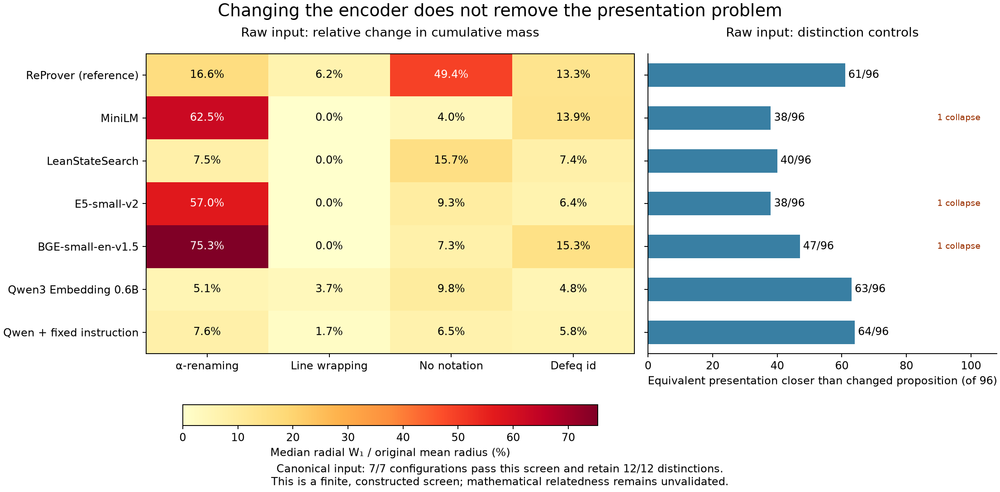

# Alternative encoders: presentation invariance and distinction retention

This study tests five alternatives to ReProver: MiniLM, LeanStateSearch2025.3,
E5-small-v2, BGE-small-en-v1.5 and Qwen3-Embedding-0.6B. Qwen is also tested with
one fixed instruction. ReProver is rerun as the reference. Every configuration
uses both raw Lean displays and separately generated canonical displays.

**None of the five alternatives passes the raw-display invariance screen.**
Every one changes F_T in all eight fixtures under α-renaming and the verified
defeq restatement. Lean-derived canonical inputs eliminate these tested changes
and preserve all 12 contrasting proposition pairs for the alternatives. That
is a limited input-representation repair, not validated mathematical geometry.

## Main comparison

Values in the four sensitivity columns are median radial W1 divided by the
original mean radius, expressed as percentages. Lower means less movement under
that transformation on these fixtures. These are descriptive effect sizes;
they are not tuned pass/fail thresholds or model-quality scores.

| Raw encoder | α-renaming | Line wrapping | No notation | Defeq id | Equivalent closer / 96 | Collapsed pairs / 12 |
|---|---:|---:|---:|---:|---:|---:|
| ReProver reference | 16.6% | 6.2% | 49.4% | 13.3% | 61 | 0 |
| MiniLM | 62.5% | 0.0% | 4.0% | 13.9% | 38 | 1 |
| LeanStateSearch | 7.5% | 0.0% | 15.7% | 7.4% | 40 | 0 |
| E5-small-v2 | 57.0% | 0.0% | 9.3% | 6.4% | 38 | 1 |
| BGE-small-en-v1.5 | 75.3% | 0.0% | 7.3% | 15.3% | 47 | 1 |
| Qwen3 Embedding 0.6B | 5.1% | 3.7% | 9.8% | 4.8% | 63 | 0 |
| Qwen + fixed instruction | 7.6% | 1.7% | 6.5% | 5.8% | 64 | 0 |

The BERT-family models remove line-wrap differences during tokenization, but
still respond strongly to renaming and restatement. Qwen reduces several of
those effects and retains the distinctions, while remaining sensitive to all
four transformations. Its fixed instruction changes the pattern of sensitivity
and improves only one of the 96 comparison outcomes; no statistical improvement
claim follows. Disabling notation changes seven fixtures; the eighth fixture's
text stays identical, so its nonfailure is an identity control.

Raw nearest-center sets also change: across the four transformation arms the
counts are MiniLM (1, 0, 2, 0), LeanStateSearch (0, 0, 1, 0), E5 (4, 0, 1, 0),
BGE (2, 0, 1, 0), and unprompted Qwen (2, 1, 3, 0). The full distance matrices,
tie sets, order reversals and witnesses are retained. No mathematical gold
ranking is assumed; these are changes under equivalent presentations.



## Decision

Changing models alone does not resolve Fix 1. The raw MiniLM/E5/BGE defaults
also lose an actual logical distinction before the neural network sees it.
LeanStateSearch and Qwen retain all 12 distinctions, making them useful candidates
for further measurement work, but their raw distances and F_T remain unqualified.

The useful next implementation is the explicit Lean-derived input policy,
followed by independent validation beyond this suite. It makes the tested
equivalent presentations identical without collapsing these 12 distinctions.
Keep LeanStateSearch and unprompted Qwen as two candidate encoders for that
validation; this experiment does not establish a winner for mathematical
relatedness or justify their extra cost over a structural representation.
The simple structural control matters precisely because passing these tests
does not require a neural model to understand mathematics.

The completed control results make that limit explicit:

| Representation / control | Changed F_T cases / 32 | Equivalent closer / 96 | Collapsed pairs / 12 |
|---|---:|---:|---:|
| Each of the seven neural configurations, canonical input | 0 | 96 | 0 |
| Token n-grams, canonical display | 0 | 96 | 0 |
| Token n-grams, canonical structural signature | 0 | 96 | 0 |
| Constant vector, either input representation | 0 | 0 | 12 |

All independent repeat encodings have zero drift, so every run uses the
predeclared 1e-6 numerical identity tolerance. Canonical point and radius drift
are also exactly zero, not merely below that tolerance. The raw ReProver fixture
vectors match the original screen to 1e-12. Thus the new harness does not rescue
ReProver by changing its raw fixture inputs or numerical representation.

Do not advance to corpus expansion or mathematical case studies on the strength
of this finite canonical-input success. Test additional defeq transformations,
dependent contexts, typeclasses, universes, local definitions and declaration
changes, then assess independently justified mathematical distinctions and
relationships. The complete structured-State acquisition problem also remains
open. No learned correction or model training was used here.

## What was tested

The original eight theorem fixtures and 16 verified proofs are unchanged. Their
44 nonempty State occurrences, including all pending goals and repetitions,
appear in five presentations: original, α-renamed, narrow printing, notation
disabled, and a transparent definitionally equal `id` wrapper around the goal.
The initial State remains the center of each object's F_T. Both center and
States are transformed together. Sixteen terminal checkpoints remain archived
outside the geometry. No extra State is manufactured for the center.

Twelve additional pairs test distinctions in a fixed local context: logical
connectives, implication direction, negation, omitted assumptions within a
proposition, equality, order and list emptiness. Lean checks that each pair is
not definitionally equal and proves a concrete truth-value disagreement under
an explicit valuation. These are local proposition distinctions, not a claim
that their universally closed forms are logically inequivalent or that we know
a correct continuous distance between them.

Each side of each pair has the same five presentation arms. For each of the
two original anchors, compare its distance to each equivalent presentation
against its distance to the changed proposition. That yields **96 descriptive
comparisons** (12 pairs × 2 anchors × 4 transformations). Some printer arms
leave an input unchanged, so the total includes easy identity controls. It is
not a calibrated task accuracy or a population estimate. All ties are retained.

The resulting inventory has **340 physical rows per representation**: 220
fixture rows plus 120 contrast rows. Each run also independently re-encodes the
68 original rows. Exact repeated input strings are memoized during the main
pass and expanded back to distinct physical vector rows; the repeat pass
bypasses that cache. This avoids redundant inference without deduplicating
State occurrences or their mass.

## Separate the encoder from its input

A concrete raw-input failure is:

```text
xs : List Nat               xs : List Nat
⊢ xs = []                   ⊢ xs ≠ []
```

MiniLM, E5 and BGE produce identical token sequences and exactly identical vectors
for this pair. The exploratory tokenizer diagnostic locates the failure before
the neural network: their normalizers turn `≠` into `=`. LeanStateSearch's
normalizer preserves the operator. This is not merely a small embedding distance
or an unknown-token count; it is loss of the distinction in the actual inputs.

The canonical display uses `Eq` versus `Ne` with explicit type/universe printing,
so the two inputs stay distinct. `tokenizer-symbol-diagnostic.json` preserves
the normalization settings and exact symbol tokens; the full State token IDs
are in each model's raw-token archive. This diagnostic was added after observing
the collision and did not change model selection, inputs or thresholds.

The canonical branch operates on Lean expressions, not regex substitutions on
printed strings. It fixes local and bound names, printer options and width,
erases metadata, and applies explicit beta/zeta and `id` reductions. Lean checks
every resulting obligation definitionally equal to its original. Each transformed
input is processed independently; the canonicalizer does not look up the original
arm, theorem identity, proof name or pair label.

The ordered context, target and their boundary remain distinguishable. For
example, introduction changes a State's layout even when reclosing its telescope
would reconstruct the initial proposition. A separate structural control hashes
token n-grams of the canonical closed expression together with the local-context
length, for each pending goal in order. It is a syntax control over structure,
not a learned mathematical-distance model.

If canonical inputs produce identical vectors, that is invariance enforced by
the representation policy. It is not evidence that any neural encoder learned
α-equivalence or definitional equality. These distinctions are also tested with
a constant-vector encoder, which must fail to distinguish all 12 pairs even
though its F_T curves never change.

## What a result can establish

The unchanged numerical tolerance is max(1e-6, ten times independent repeat
drift). We report F_T changes using radial Wasserstein-1, as well as sup CDF
difference and paired radius drift. A permutation of radii changes paired
positions without changing F_T, so those are measured separately. A large CDF
jump may accompany a tiny horizontal displacement; W1 supplies the distance
scale. Relative W1 divides by the original mean radius of each fixture, then
takes the median across the eight fixtures. Zero-radius objects are reported
without that ratio. Raw embedding distance magnitudes across models are not
directly comparable measures of quality.

The contrast check rejects trivial collapse and tests whether presentation
changes can exceed an actual proposition change. It is still a small constructed
suite. Passing it does not demonstrate useful mathematical neighborhoods,
faithful proof-route geometry, coverage of the admitted corpus, or stability
under all definitionally equal formulations. The canonical policy deliberately
does not unfold arbitrary definitions, normalize arbitrary universes, reorder
declarations, quotient by logical equivalence, or handle general local lets.
The fixtures contain no typeclass-heavy or dependent mathematical developments.

## Models and execution

| Configuration | Output dimension | Pooling / input convention |
|---|---:|---|
| Existing ReProver | 1472 | Singleton quantized encoder; all-token mean |
| Existing MiniLM | 384 | Quantized ONNX; content-token mean, fixed windows |
| LeanStateSearch2025.3 | 768 | Mean of all nonpadding tokens |
| E5-small-v2 | 384 | Mean; `query: ` prefix on every input |
| BGE-small-en-v1.5 | 384 | First token (CLS); no retrieval instruction |
| Qwen3-Embedding-0.6B | 1024 | Last token; no instruction |
| Qwen with instruction | 1024 | Last token; one fixed symmetric instruction |

All vectors are L2 normalized. The four downloaded models run locally in CPU
float32, in evaluation mode, with singleton batches and eager attention; their
tokenizers never truncate. The existing quantized adapters remain intact.
Token IDs, unknown-token counts and contrast-pair token collisions are archived.
An unknown token alone is not proof of a lost mathematical distinction: for
example, a shared turnstile can be unknown in every State. Actual collisions
between the controlled propositions are reported separately.

Pooling follows the published [LeanStateSearch configuration](https://huggingface.co/ruc-ai4math/LeanStateSearch2025.3/blob/b3507394baec2f1cedcc41e320d956b366ece35b/1_Pooling/config.json),
[E5 usage](https://huggingface.co/intfloat/e5-small-v2),
[BGE usage](https://huggingface.co/BAAI/bge-small-en-v1.5), and
[Qwen usage](https://huggingface.co/Qwen/Qwen3-Embedding-0.6B).
Each `encoder.json` pins the repository revision and all downloaded file hashes.
Qwen's additional instruction is fixed in the protocol before its execution;
no prompt search or tuning was performed. No model was trained.

## Reproduce

The archive can be checked with the existing base environment, without model
weights, torch, or a fresh Lean invocation:

```bash
OPENBLAS_NUM_THREADS=1 .venv/bin/python scripts/compare-encoders.py verify
```

For a fresh run, use a separate output directory to preserve these completed
results. Bootstrap the base project, its existing MiniLM/ReProver
dependencies and pinned Lean toolchain first. Install the additional runtime
in its own environment:

```bash
python3 -m venv .tools/encoder-comparison-venv
.tools/encoder-comparison-venv/bin/pip install --no-cache-dir \
  torch==2.7.1 --index-url https://download.pytorch.org/whl/cpu
.tools/encoder-comparison-venv/bin/pip install --no-cache-dir \
  -r results/phase-1-recognition/encoder-comparison-v1/requirements-transformers.lock
.venv/bin/python scripts/bootstrap-comparison-encoders.py
OPENBLAS_NUM_THREADS=1 .venv/bin/python scripts/compare-encoders.py prepare \
  --output outputs/encoder-comparison-new
```

Run `scripts/compare-encoders.py encode --model NAME --output outputs/encoder-comparison-new`
serially: use the base
`.venv/bin/python` for `minilm`, `reprover`, `syntax`, `structural`, and `constant`;
use `.tools/encoder-comparison-venv/bin/python` for `leansearch`, `e5`, `bge`,
`qwen`, and `qwen-instruct`. Set `OPENBLAS_NUM_THREADS=1 OMP_NUM_THREADS=1`.
Completed model outputs are protected against overwrite. Then:

```bash
OPENBLAS_NUM_THREADS=1 .venv/bin/python scripts/compare-encoders.py summarize \
  --output outputs/encoder-comparison-new
OPENBLAS_NUM_THREADS=1 .venv/bin/python scripts/compare-encoders.py seal \
  --output outputs/encoder-comparison-new
```

`protocol.md` is the pre-execution plan. `Fixtures.lean`, `Controls.lean` and their
logs retain all formal checks. `formal-validation.json` records exact matching
to the frozen raw fixture displays. `inputs.json` supplies ordered row identities,
raw and canonical displays, structural signatures and expression certificates.
Each model directory holds vectors, independent repeats, exact token IDs,
model hashes, timing and complete numerical results. `run-receipts.json` records
the serial driver outcomes; MiniLM has its own execution receipt. `comparison.svg`
is an exportable figure. Regenerate that archived figure with
`scripts/render-encoder-comparison.py` using the plots dependency. The generator
`scripts/prepare-encoder-comparison.py` documents how the two Lean source files
were derived; fresh `prepare` copies and reruns those frozen sources.
`execution-source/` preserves the runner and adapter bytes referenced by execution
hashes, including the runner before the later addition of separate-output support.
`SHA256SUMS` covers the evidence archive.
